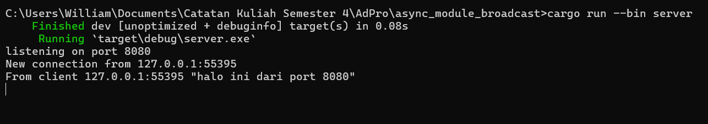

#  Reflection
## 2.1 Original Code of Broadcast Chat
- Client


- Server


Untuk menjalankan satu server, kita perlu menjalankan perintah sebagai berikut
```
cargo run --bin server
```

Untuk menjalankan satu client, kita perlu menjalankan perintah sebagai berikut
```
cargo run --bin client
```

Setelah meng-run server dan client dan kita mengetikkan sesuatu dari client, server akan menerima pesan tersebut dari client dan server akan meneruskan pesan dari client tersebut ke seluruh client yang terhubung ke server tersebut. 

## 2.2 Modifying The Websocket Port
- Server


- Client


Kita diminta untuk mengubah port dari 2000 menjadi 8080, maka kita perlu mengubah kedua port untuk server dan client agar mereka dapat terhubung dalam port yang sama dan bisa mengirim/menerima data. Kita dapat mengubah port dari server dengan mengubah potongan kode dibawah ini
```
let listener = TcpListener::bind("127.0.0.1:8080").await?;
```

Kita juga dapat mengubah port dari client dengan mengubah potongan kode dibawah ini
```
ClientBuilder::from_uri(Uri::from_static("ws://127.0.0.1:8080"))
```
Walaupun portnya diubah dari 2000 menjadi 8080, fungsionalitas program masih sama yaitu ketika satu client mengirimkan pesan ke server, maka server akan mengirimkan pesan tersebut ke seluruh client yang sedang terhubung ke server tersebut, hanya saja yang berbeda adalah server dan client melakukan pengiriman dan penerimaan data melalui port 8080, tidak melalui port 2000 lagi.

## 2.3 Small Changes, Add Some Information to Client
- Server


- Client


Disini, ketika kita mengirimkan pesan dari client ke server, server kemudian akan mengirimkan pesan ke seluruh client dengan format {IP Client} : {Pesan}. Untuk dapat melakukan hal ini, saya melakukan modifikasi di bagian server.rs pada bagian kode 
```
bcast_tx.send(text.into())?;
```
menjadi seperti berikut ini
```
bcast_tx.send(format!("{addr} : {text}"))?;
```
Modifikasi kode sebagai berikut akan mengirimkan data ke seluruh client dengan format {addr pengirim} : {text}